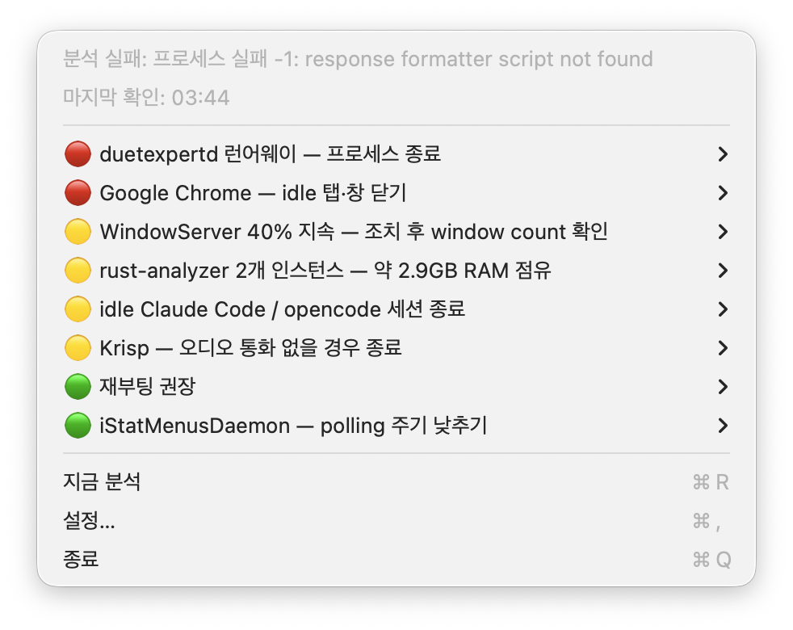

# mac-optimizing-looper

[English](README.md) · **한국어** · [简体中文](README-zh-Hans.md) · [繁體中文](README-zh-Hant.md) · [日本語](README-ja.md) · [Español](README-es.md) · [Deutsch](README-de.md) · [Français](README-fr.md) · [Português](README-pt-BR.md) · [Русский](README-ru.md)

**N분마다 Mac 부하를 Claude에게 보냄 → Claude가 CPU/RAM을 실제로 잡아먹는 범인을 심각도순으로 정렬하고, 정확한 해결 명령을 메뉴바에 띄움. 클릭 한 번이면 실행되지만, 두 번째 Claude 패스가 그 명령을 SAFE로 판정한 뒤에만 실행됨.**

Dock 아이콘 없는 macOS 메뉴바 앱. 로컬 LLM CLI 위에서 **관찰 → 모델에게 질의 → 제안 → (선택적) 실행** 루프를 계속 돌림. 스스로는 절대 시스템을 건드리지 않음. 모든 동작은 명시적이고 위험 검사를 거친 클릭 한 번임.

**프로바이더:** 기본 백엔드는 `claude` CLI이며 `codex` CLI도 지원함. 설정에서 **프로바이더 / 모델 / 속도 / Fast Mode**를 고름 — 모델과 추론 강도는 각 CLI에서 실시간으로 읽어옴. codex는 분석이 스키마 기반 단일 패스임(별도 포맷 패스 없음).

**언어:** UI를 10개 언어로 완전히 현지화했음(English, 한국어, 简体中文, 繁體中文, 日本語, Español, Deutsch, Français, Português do Brasil, Русский). 설정의 **Language** 피커가 UI 언어와 분석 출력 언어를 함께 정함. "System default"는 macOS 언어를 따라감.

<p align="center"></p>

## 루프 한 사이클

```
⏱  타이머 발화 (기본 1시간, 슬라이더 10분 … 36시간)
→  수집: CPU/MEM + mac-optimizer 스냅샷 (+ 선택적 지속 샘플)
→  claude -p   (분석 패스, --effort max)
→  claude -p   (포맷 패스 → 정렬된 JSON 제안)
```

메뉴바에 개수가 뜨고, 드롭다운은 심각도 높은 순으로 정렬됨(🔴 위급 → 🟡 경고 → 🟢 위생). 각 행은 Copy / Show in Terminal / Review with Claude / Run Command Now로 펼쳐짐:

<p align="center"></p>

## 해결 실행 — 게이트가 걸린 경로

"Run Command Now"는 무언가를 실제로 실행하는 *유일한* 경로이며, 끝까지 게이트가 걸려 있음:

```
클릭 ▸ Run Command Now   ($ kill 8123)
→  claude -p   판정 → RISK: SAFE
→  백그라운드 실행   (sudo → TTY 없으므로 GUI 비밀번호 프롬프트)
→  ✅ 알림 → 클릭 → 전체 stdout/stderr 창
→  제안에 ✓ 완료 표시
```

`SAFE`가 아닌 모든 경우 — `unknown` 포함 — 기본 버튼이 **취소**인 확인 대화상자를 띄움.

## 시스템 프롬프트 (요약 발췌)

```
You are a macOS performance analyst.
Given live metrics + a process table, identify the ACTUAL remediation
command (kill / killall / unload) for each real problem — never an
inspection command (no pgrep / ps / top).

MUST:     rank by severity; prefer graceful `kill <pid>` over `kill -9`.
MUST:     return a null command when no command-line action applies.
MUST NOT: claim anything was executed — the app never auto-runs.
```

## 사이클이 건드릴 수 있는 것

| 단계 | 도구 | 부작용 |
|---|---|---|
| 수집 | `MetricsCollector`, `mac-optimizer.sh` | 읽기 전용 |
| 분석 | `claude -p` (effort = max) | 네트워크, 읽기 전용 |
| 포맷 | `claude -p` (effort = low) | 정렬된 JSON |
| 위험 검사 | `claude -p` | 네트워크, 읽기 전용 |
| 실행 | `CommandExecutor` | **명령 실행** (사용자 시작 시에만) |
| 검토 | 설정한 터미널 + 인터랙티브 `claude` | 터미널 염 |

## 의사결정 흐름

```
타이머 → 수집 → claude 분석 → 제안 정렬
                                   │
              사용자가 동작 선택 ──┼─ Copy / Show in Terminal → 실행 없음
                                   ├─ Review with Claude       → 인터랙티브 claude 세션
                                   └─ Run Command Now
                                          → claude 위험 검사
                                               ├─ SAFE → 실행 → 알림 → ✓
                                               └─ 그외 → 확인 (기본 취소)
```

## 설치

PATH 위의 `claude` CLI 필요. macOS 13+.

```bash
brew install --cask kargnas/tap/mac-optimizing-looper
```

> _cask + DMG는 첫 서명 릴리스 후 활성화됨. 릴리스 파이프라인은 연결돼 있고 서명 secret 입력을 기다리는 중 — [docs/release-setup.md](docs/release-setup.md) 참고. 그 전까지는 아래 소스 빌드를 쓸 것._

### 소스 빌드

```bash
git clone https://github.com/kargnas/mac-optimizing-looper
cd mac-optimizing-looper
bash script/build_and_run.sh run     # .app 빌드, ad-hoc 코드사인, 실행
```

bare 바이너리가 아니라 **번들**로 실행할 것 — `UNUserNotificationCenter`는 실제 bundle id(`as.kargn.MacOptimizingLooper`)가 필요함. 설정은 `~/.config/mac-optimizing-looper/config.json`에 있음(`config.example.json` 복사): model, thinking level, monitor seconds, interval, terminal, language.

## 한계 / 거부하는 것

- **스스로 행동하지 않음.** 제안은 비활성 데이터일 뿐, "Run Command Now"만 실행하며 당신의 클릭에서만 — `GuardrailTests`로 고정됨.
- **unknown 위험 = 위험으로 취급.** Fail-safe, 당신이 확인함.
- **`sudo` → GUI 비밀번호 프롬프트.** 백그라운드 실행은 TTY가 없으므로 root 명령은 `osascript … with administrator privileges`로 라우팅됨.
- **`claude` CLI 없음 = 제안 없음.** 추측하지 않고 오류를 드러냄.
- 알림은 앱 번들이 필요함. bare 바이너리는 알림을 못 띄우고 결과 창을 직접 여는 것으로 폴백함.

